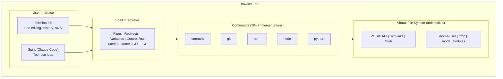
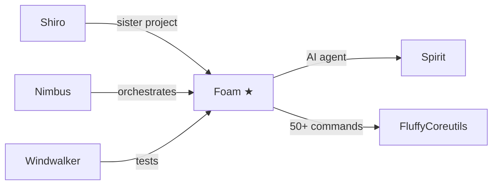

# Foam - Browser-Native Cloud OS

A complete development environment running in your browser. No servers. No build step. No native dependencies. Just open `index.html` and start coding.

**Live Demo:** [williamsharkey.github.io/foam](https://williamsharkey.github.io/foam)

## Zero-Install Development

```bash
# Clone a GitHub repository
git clone https://github.com/lodash/lodash

# Install real npm packages
npm install lodash dayjs chalk

# Run commands with pipes and redirects
find src -name "*.js" | xargs grep "export" | sort | uniq

# Write and execute JavaScript
node -e "console.log(require('lodash').chunk([1,2,3,4,5], 2))"

# Let Claude Code do the work
spirit "create an Express server with user authentication"
```

**Everything runs in your browser tab.** Files persist in IndexedDB. Reload the page—your work is still there.

## Why Foam?

- **No backend.** Claude talks directly to the Anthropic API. Commands run in-page. No relay server.
- **No build step.** Plain ES modules. No bundler, no transpiler. Just serve the files.
- **Single HTML file.** Deploy anywhere: GitHub Pages, S3, `file://` protocol.
- **Persistent filesystem.** IndexedDB survives reloads. Your project state is always there.
- **AI-first.** Claude Code (Spirit) has full filesystem and shell access out of the box.

## Feature Highlights

### 50+ Unix Commands
Real implementations with proper stdin/stdout/stderr:

| Category | Commands |
|----------|----------|
| **Files** | `ls -laR`, `cat -n`, `head`, `tail`, `touch`, `cp -r`, `mv`, `rm -rf`, `mkdir -p`, `find`, `ln` |
| **Text** | `grep -rni`, `sed 's/a/b/g'`, `sort`, `uniq`, `wc -lwc`, `tr`, `cut`, `diff`, `tee`, `xargs` |
| **Shell** | `cd`, `pwd`, `echo -ne`, `printf`, `env`, `export`, `which`, `test`/`[` |
| **Dev** | `git`, `npm`, `node` |

### Real Git
Full version control via isomorphic-git:
```bash
git init
git clone https://github.com/user/repo
git add . && git commit -m "initial commit"
git log --oneline
git diff HEAD~1
git branch feature && git checkout feature
git status
```

### Real npm
Downloads actual packages from `registry.npmjs.org`:
```bash
npm init
npm install lodash express chalk
npm list
npm run build
npm uninstall lodash
```

### Node.js Runtime
Execute JavaScript with CommonJS require():
```bash
node script.js
node -e "console.log(require('lodash').VERSION)"
node -p "2 + 2"
```

Built-in shims for `fs`, `path`, `process`, `Buffer`, `child_process`, and more.

### Full Shell Scripting
```bash
# Variables and expansion
export NAME="Foam" && echo "Hello $NAME"

# Pipes and redirects
cat data.txt | grep error | sort | uniq > errors.txt

# Control structures
for f in *.js; do echo "Processing $f"; wc -l "$f"; done

if [ -f package.json ]; then npm install; fi

# Command substitution
echo "Today is $(date)"

# Functions
greet() { echo "Hello, $1!"; }
greet World
```

### Claude Code Integration (Spirit)
AI agent with full shell and filesystem access:
```bash
spirit "refactor this code to use async/await"
spirit "add error handling to the API endpoints"
spirit "write tests for the User model"
```

Spirit can read files, write files, run commands, and iterate until the task is complete.

### Python via Pyodide
Full Python 3.11 runtime:
```bash
python -c "print('Hello from Python!')"
python script.py
pip install numpy pandas
```

### Terminal Raw Mode
Interactive input for editors and tools that need character-by-character control.

### Persistent Filesystem
Everything stored in IndexedDB:
- Files survive page reload
- Git history persists
- node_modules cached
- Work in progress never lost

## Architecture



## Quick Start

**Online:** Visit [williamsharkey.github.io/foam](https://williamsharkey.github.io/foam)

**Local:**
```bash
git clone https://github.com/williamsharkey/foam
cd foam
# Just open index.html in a browser - no build step!
python -m http.server 8000  # Or any static file server
```

**Configure Claude:**
```bash
foam config set api_key sk-ant-...
```

## File Structure

```
foam/
├── index.html          # Single entry point (no build required)
├── style.css           # Terminal styling
├── src/
│   ├── vfs.js          # Virtual filesystem (IndexedDB + memory cache)
│   ├── shell.js        # Command parser (pipes, redirects, variables)
│   ├── commands.js     # 50+ Unix command implementations
│   ├── terminal.js     # Terminal UI (history, ANSI, raw mode)
│   ├── claude.js       # Claude API client
│   ├── devtools.js     # git, npm, node implementations
│   └── foam-provider.js # Spirit OSProvider adapter
└── spirit/             # Spirit submodule
```

## Comparison

| Feature | Foam | StackBlitz | CodeSandbox | Replit |
|---------|------|------------|-------------|--------|
| No backend | Yes | No | No | No |
| No build step | Yes | No | No | No |
| Works offline | Yes | Partial | No | No |
| Single HTML file | Yes | No | No | No |
| AI integration | Spirit | No | AI assist | Ghostwriter |
| Open source | Yes | No | Partial | No |
| Self-hostable | Yes | No | No | No |

## Design Philosophy

1. **IO compatibility over features.** Commands don't need every flag—they need correct stdin/stdout/stderr/exit-code so Claude's tool-use works like a real terminal.

2. **No build step.** ES modules loaded directly. Change a file, refresh the page.

3. **Claude is a first-class user.** Tool definitions map 1:1 to shell commands. No adapter layer.

4. **Persistence by default.** Your work survives reloads, crashes, and browser restarts.

## Related Projects



- [Shiro](https://github.com/williamsharkey/shiro) - TypeScript/Vite sister project (more features, requires build)
- [Spirit](https://github.com/williamsharkey/spirit) - Claude Code agent library
- [Nimbus](https://github.com/williamsharkey/nimbus) - Multi-repo orchestration dashboard
- [Windwalker](https://github.com/williamsharkey/windwalker) - Test automation suite
- [FluffyCoreutils](https://github.com/williamsharkey/fluffycoreutils) - Shared Unix commands

## License

MIT
